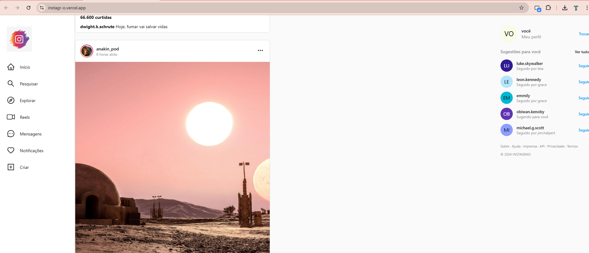

# 📸 Instagrão - Clone do Instagram em React

Este projeto é uma recriação da interface do Instagram desenvolvida com **React**, com foco em uma experiência moderna, fluida e fiel ao design da aplicação original.

## 🚀 Sobre o projeto

O **Instagrão** foi desenvolvido com o objetivo de praticar e consolidar conceitos essenciais do desenvolvimento front-end, como:

* Componentização
* Reutilização de código
* Organização de pastas
* Gerenciamento de estado
* Boas práticas com React

A aplicação simula funcionalidades visuais do Instagram, como feed de postagens, stories e sugestões de usuários, trazendo uma interface limpa e responsiva.

## 🖼️ Preview do projeto

### Feed principal

## 🖼️ Preview do projeto

### Feed principal

### Stories e navegação

## 🛠️ Tecnologias utilizadas

* React
* JavaScript
* HTML5
* CSS3

## 💡 Aprendizados

Durante o desenvolvimento, enfrentei desafios práticos como:

* Ajustes finos de layout
* Organização de assets
* Correção de erros de importação
* Estruturação de componentes reutilizáveis

Esses pontos foram fundamentais para evoluir minha visão sobre como aplicações reais são construídas.
